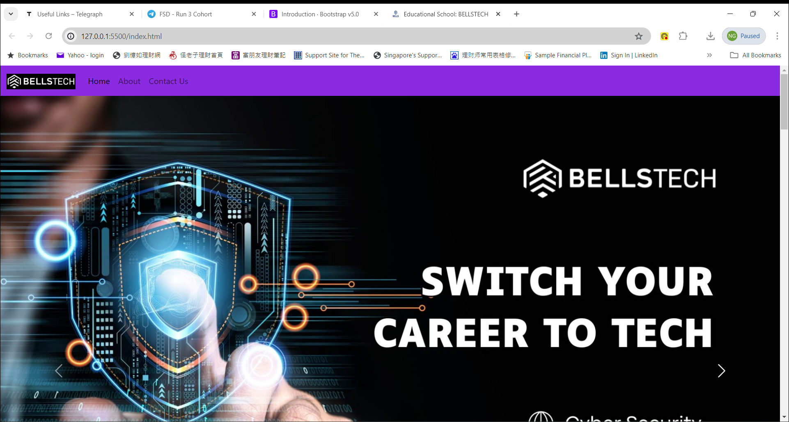

<!-- .md means markdown -->

<!-- README.md -->
<!-- This file documents the information about the portfolio project. -->
<!-- It should be READ ME first!!! -->

<!-- Heading level 1 -->
# BELLS-TEST
**(SCTP) Full Stack Developer**

Module 2: **UX (User Experience) Design and User Interface Theory**

***Project Assignment - Portfolio***

<!-- Heading level 3 -->
### Project File Structure:

* HTML Files (hypertext markup language)

>>> Home page (Landing Page)
: index.html

>>> About page
: about.html

>>> Contect Us page
: contact-us.html

* CSS Folder (cascading style sheets)
: bootstrap.css
: main.css
: reset.css
: style.css

* IMG Folder (images)
: bells_logo.jpg
: bellstech_logo.png
: sctp-series.jpg
: cybersecurity.jpg
: datascience.jpg
: fullstack.jpg
: blockchain.jpg
: coder.jpg
: sctp-salary.jpg
: home.png
: index.png
: button-LearnMore.png
: phone.png
: mobile.png
: email.png
: phone-app.png
: whatsapp-app.png
: outlook-app.png

* RES Folder (resources)
: bells.ico

* MEDIA Folder (multimedia)
: \<empty\>

* JS Folder (javascript)
: \<empty\>

<!-- Heading level 1 -->
# Project Guide
For the purpose of the portfolio project, a landing page is created for the following:

```json
{
1. "An educational school" : in our case "Educational School: BELLSTECH"
}
```

This project is about *SkillsFuture Career Transition Programme (SCTP)* at **BELLSTECH**. 

The application of this project caters to the needs of a specific target user group, the mid-career changers,
who are looking for information on SCTP Courses at BELLSTECH, a tech business unit of [Bells Institute of Higher Learning][1].

The website provides an one-stop entry point to the SCTP Courses available, namely:

***
1. *(SCTP) Cyber-Security*
2. *(SCTP) Data-Science*
3. *(SCTP) Full-Stack*
4. *(SCTP) Block-Chain*
***

It also explains the tech roles [^bignote] and its briefing on these domain areas[^1], with contents created using AI Tool [Microsoft Copilot][2].

The web development is done using [Visual Studio Code][3] with responsive design concepts that provide media query breakpoints based on the following screen sizes:

***Bootstrap Breakpoints***
    
| Device(s) | Description | Prefix | Screen Sizes |
| :--- | :---: | :---: | ---: |
| phones | Extra small | None | <576px |
| portrait tablets and large phones | Small | sm | ≥576px |
| landscape tablets | Medium | md | ≥768px |
| laptops/desktops | Large | lg | ≥992px |
| large laptops and desktops | Extra large | xl | ≥1200px |
| large tv screens | Extra extra large | xxl | ≥1400px, max:1580px |


This simple website has a Bells logo and navigational bar with Home, About and Contact Us links in the landing page.\
This provides an inner site navigation that allows the user to view the different pages in the site.\
It also uses navbar, carousel, container, cards, form, badge, button and radio buttons from CSS Bootstrap.



The website is deployed using [GitHub Pages][4] so that it is available via a public web address.

<!-- Heading level 4 -->
#### The url for the portfolio project is here:

- [Educational School: BELLSTECH](https://ngys9919.github.io/bells-test/ "My project-website!")
: Click the hyperlink <https://ngys9919.github.io/bells-test/>

<!-- Heading level 4 -->
#### The source codes is hosted as public on a Github repository and the link is as follows: 

- [Source Codes Github Link](https://www.github.com/ngys9919/bells-test "My source-codes!")
: Click the hyperlink <https://www.github.com/ngys9919/bells-test>

<!-- Heading level 2 -->
## About
> This project work, part of **Module 2: UX (User Experience) Design and User Interface Theory**, 
> is an individual assessment done by Candidate’s Name (as in NRIC): **Ng Yew Seng** (Candidate’s NRIC: **S XXXX 3 5 3 / F**), 
> a trainee under the **(SCTP) Full Stack Developer** course, organized by **Bells Institute of Higher Learning**. 

>>
>> © Copyright 2024\
>> Coder: ***Ng Yew Seng***

<!-- Heading level 2 -->
## Technologies Used
- [x] HTML5
- [x] CSS3
- [x] CSS Framework (Bootstrap v5.3.3)

<!-- Heading level 2 -->
## References
1.  [Microsoft Visual Studio Code](https://code.visualstudio.com)
    
2.  [Microsoft Copilot](https://copilot.microsoft.com)

3.  [Microsoft GitHub](https://www.github.com)
   
4.  [Bells Institute of Higher Learning](https://bells.sg)

5.  TECH TALK: Bells Trainers Symposium 2024

<!-- Heading level 6 -->
###### Footnotes
--------------
[^bignote]: Tech roles include Cyber-Security Professional (such as penetration testers, security engineers, incident responders, and security consultants), Data-Science Specialist (data engineers, data analysts, and data scientists), Full-Stack Developer (UX/UI designers, front-end developer, and back-end developer) and Blockchain Developer (\*blockchain software developer, and web3 developer).

[^1]: Domain areas include Cyber-Security, Data-Science, Full-Stack, and Block-Chain.

--------------

<!-- hyperlinks -->
[4]: https://github.com "GitHub"
[3]: https://code.visualstudio.com "Visual Studio Code"
[2]: https://copilot.microsoft.com "Microsoft Copilot"
[1]: https://bells.sg "Bells Institute of Higher Learning"
